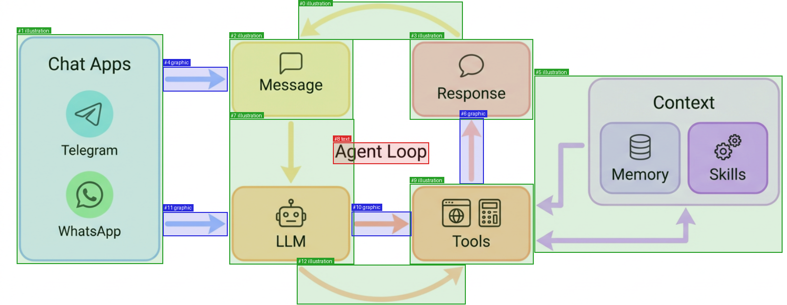
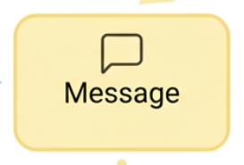
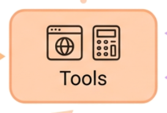
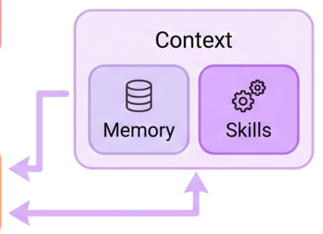
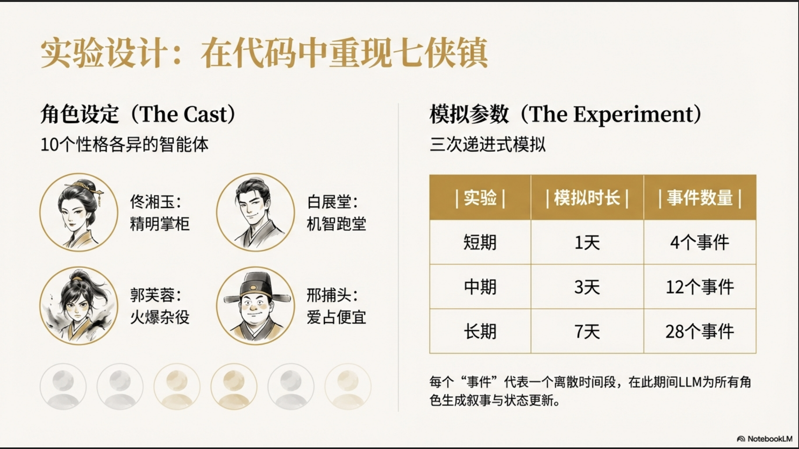
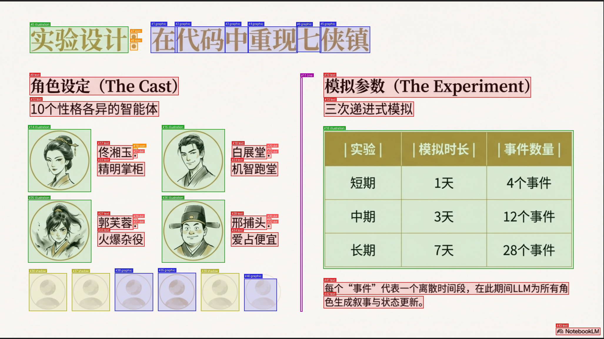
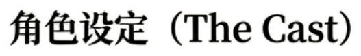
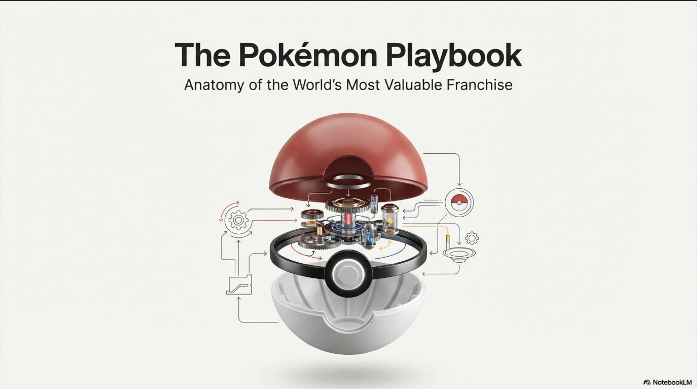
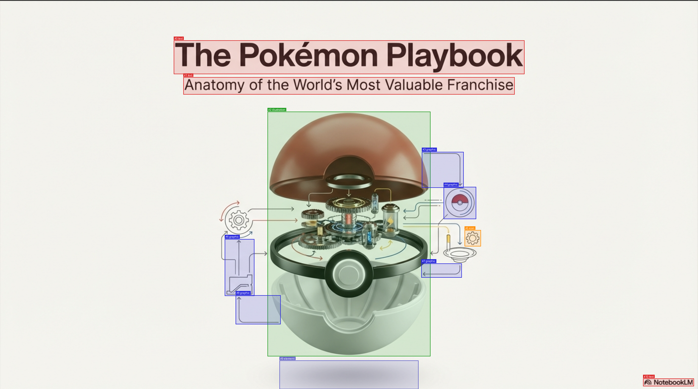
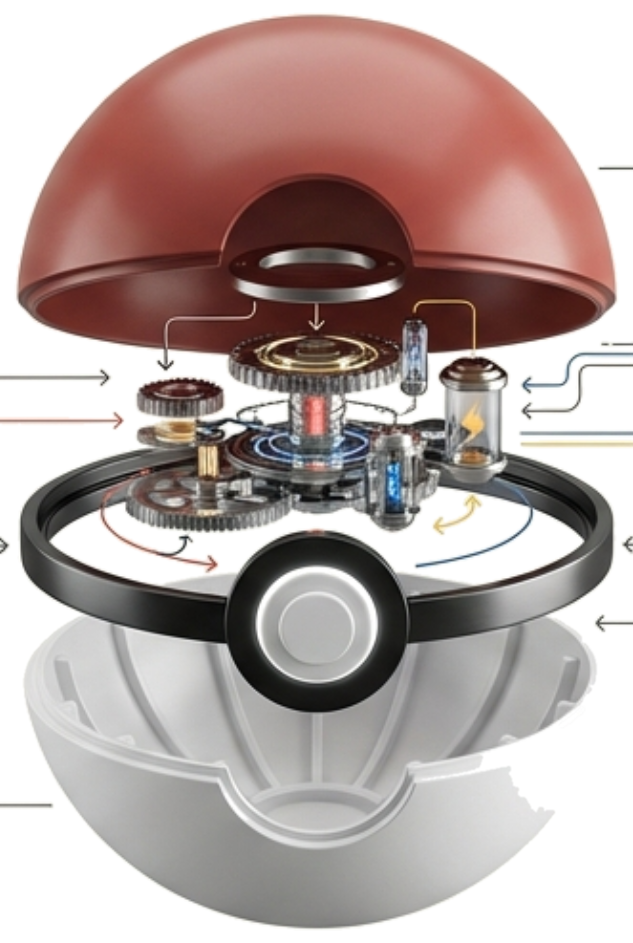

# px-asset-extract

[](https://opensource.org/licenses/MIT)
[](https://www.python.org/downloads/)
[](https://huggingface.co/spaces/pxGenius/px-asset-extract)

Extract individual assets from images -- posters, infographics, slides, diagrams -- as transparent PNGs with a JSON manifest. Zero ML models, zero API calls, pure classical computer vision.

**[Try the live demo on Hugging Face](https://huggingface.co/spaces/pxGenius/px-asset-extract)**

[Try it online](https://socialistic.ai/px-asset-extract-40b441?utm_source=github_readme&utm_campaign=koc_skill_creator&utm_content=hyperlink)

## Examples

### Architecture diagram -- 13 assets, 1.5s

| Input | Detected |
|-------|----------|
|  |  |

Every box, icon, and connector extracted as a separate transparent PNG:

<p>




</p>

### Slide with mixed content -- 44 assets, 2.8s

| Input | Detected |
|-------|----------|
|  |  |

Character portraits, text blocks, table cells, icons -- all individually extracted:

<p>



</p>

### Poster -- 11 assets, 3.9s

| Input | Detected |
|-------|----------|
|  |  |

<p>

</p>

### More results

| Image type | Assets found | Time |
|-----------|-------------|------|
| Architecture diagram | 13 | 1.5s |
| Infographic slide | 44 | 2.8s |
| Poster | 11 | 3.9s |
| Scientific diagram | 43 | 4.2s |
| Technical diagram | 42 | 4.5s |
| Data chart | 26 | 4.8s |

## Installation

```bash
git clone https://github.com/JadeLiu-tech/px-asset-extract.git
cd px-asset-extract
pip install .
```

For higher-quality alpha edges (optional):

```bash
pip install ".[full]"
```

## Quick Start

```python
from px_asset_extract import extract_assets

result = extract_assets("poster.png", output_dir="assets/")
print(f"Extracted {result.num_assets} assets")
```

This produces:
- Individual transparent PNGs for each detected object
- `manifest.json` with positions, types, and metadata
- `visualization.png` showing detected regions

## CLI Usage

```bash
# Extract assets from an image
px-extract poster.png -o assets/

# Custom thresholds (more/fewer detections)
px-extract infographic.png -o assets/ --min-area 500 --bg-threshold 30

# Only extract illustrations and icons (skip text, lines, dots)
px-extract slide.png -o icons/ --types illustration,icon

# Extract everything except text
px-extract slide.png -o graphics/ --exclude-types text,line,dot

# Extract from pre-computed regions (e.g. from a visual grounding model)
px-extract slide.png -o targeted/ --regions grounded.json

# Segment only (no extraction, outputs JSON)
px-extract poster.png --segments-only

# Batch processing
px-extract images/*.png -o output/ --batch

# JSON output for piping
px-extract slide.png -o assets/ --json
```

### CLI Options

| Option | Default | Description |
|--------|---------|-------------|
| `-o`, `--output` | `assets` | Output directory |
| `--bg-threshold` | `22.0` | Background color distance (lower = more sensitive) |
| `--min-area` | `60` | Minimum segment area in pixels |
| `--dilation` | `2` | Character gap bridging passes |
| `--padding` | `10` | Extra pixels around each asset |
| `--max-coverage` | `0.5` | Max fraction of image a segment can cover |
| `--types` | | Only extract these segment types (comma-separated) |
| `--exclude-types` | | Skip these segment types (comma-separated) |
| `--regions` | | JSON file with pre-computed bounding boxes (skips segmentation) |
| `--segments-only` | | Output segment JSON without extracting PNGs |
| `--no-visualization` | | Skip visualization image |
| `--batch` | | Create subdirectories per image |
| `--json` | | Output results as JSON to stdout |
| `--quiet` | | Suppress progress messages |

## Type Filtering

Filter extracted assets by their classified type using `--types` or `--exclude-types`:

```bash
# Only illustrations and icons
px-extract slide.png --types illustration,icon -o assets/

# Everything except text and small elements
px-extract slide.png --exclude-types text,line,dot -o assets/
```

```python
from px_asset_extract import extract_assets

# Python API
result = extract_assets("slide.png", types=["illustration", "icon"])
result = extract_assets("slide.png", exclude_types=["text", "line", "dot"])
```

Valid types: `text`, `illustration`, `icon`, `graphic`, `line`, `dot`, `diagram`, `diagram_network`, `shadow`, `element`.

## Pre-computed Regions

Skip segmentation entirely and extract from known bounding boxes using `--regions`. This bridges px-asset-extract with visual grounding models (like Florence-2) that can find objects by text description.

```bash
# Step 1: Use a grounding model to find specific objects
# (produces a JSON file with bounding boxes)

# Step 2: Extract those regions with clean alpha transparency
px-extract slide.png --regions regions.json -o targeted/
```

The regions JSON supports multiple formats:

```json
[
  {"x": 100, "y": 50, "width": 400, "height": 300, "label": "chart"},
  {"x": 600, "y": 100, "width": 200, "height": 200, "label": "logo"}
]
```

Also supports `x1/y1/x2/y2` corner format and `{"regions": [...]}` wrapper.

```python
from px_asset_extract import extract_assets, load_regions

regions = load_regions("grounded.json")
result = extract_assets("slide.png", regions=regions)

# Combine with type filtering
result = extract_assets("slide.png", regions=regions, types=["chart"])
```

## Python API

### One-line Extraction

```python
from px_asset_extract import extract_assets

result = extract_assets(
    "poster.png",
    output_dir="assets/",
    bg_threshold=22.0,   # Background sensitivity
    min_area=60,         # Minimum segment size
    padding=10,          # Pixels around each crop
    max_coverage=0.5,    # Filter full-image artifacts
)

for asset in result.assets:
    print(f"{asset.id}: {asset.label} at ({asset.bbox.x}, {asset.bbox.y})")
```

### Step-by-Step Pipeline

```python
from px_asset_extract import segment, classify, extract_asset

# Step 1: Find segments
segments = segment("poster.png", bg_threshold=22.0, min_area=60)

# Step 2: Classify each segment
classified = classify("poster.png", segments)

# Step 3: Extract individual assets
for seg in classified:
    asset = extract_asset("poster.png", seg, "assets/")
    print(f"{asset.id}: {asset.label} -> {asset.file_path}")
```

### Visualization

```python
from px_asset_extract import segment, classify
from px_asset_extract.visualizer import create_visualization

segs = classify("poster.png", segment("poster.png"))
create_visualization("poster.png", segs, "visualization.png")
```

## API Reference

### `extract_assets(image_path, output_dir, **kwargs) -> ExtractionResult`

Full pipeline: segment, classify, extract, and save.

**Parameters:**
- `image_path` (str): Path to input image
- `output_dir` (str): Output directory (created if needed)
- `bg_threshold` (float): Background color distance threshold (default: 22.0)
- `min_area` (int): Minimum pixel area for segments (default: 60)
- `dilation` (int): Character gap bridging passes (default: 2)
- `padding` (int): Extra pixels around crops (default: 10)
- `visualization` (bool): Generate visualization image (default: True)
- `max_coverage` (float): Max image fraction per segment (default: 0.5)
- `types` (list[str]): Only extract these segment types (default: None = all)
- `exclude_types` (list[str]): Skip these segment types (default: None)
- `regions` (list[Segment]): Pre-computed bounding boxes, skips segmentation (default: None)

**Returns:** `ExtractionResult` with `.assets`, `.manifest_path`, `.visualization_path`

### `load_regions(regions_path) -> List[Segment]`

Load pre-computed bounding boxes from a JSON file.

### `segment(image_path, **kwargs) -> List[Segment]`

Find connected components in an image.

**Parameters:**
- `image_path` (str): Path to input image
- `bg_threshold` (float): Background sensitivity (default: 22.0)
- `min_area` (int): Minimum segment area (default: 60)
- `dilation` (int): Gap bridging passes (default: 2)
- `text_dark_ratio` (float): Text detection threshold (default: 0.4)
- `line_gap` (int): Text-line merging gap (default: 35)

**Returns:** List of `Segment` objects

### `classify(image_path, segments) -> List[Segment]`

Classify segments by type (text, illustration, icon, graphic, etc.).

### `extract_asset(image_path, segment, output_dir) -> Asset`

Extract a single segment as a transparent PNG.

### `extract_crop(image, mask, bbox, padding) -> np.ndarray`

Low-level: crop a region with alpha transparency.

### Data Types

```python
@dataclass
class Segment:
    id: int
    bbox: BBox
    pixel_area: int
    label: str          # text, illustration, icon, graphic, line, etc.
    fill_ratio: float
    dark_ratio: float
    color_std: float
    mean_brightness: float
    mean_saturation: float

@dataclass
class BBox:
    x: int
    y: int
    width: int
    height: int

@dataclass
class Asset:
    id: str
    label: str
    bbox: BBox
    file_path: str
    pixel_area: int

@dataclass
class ExtractionResult:
    source_image: str
    source_size: Tuple[int, int]
    background_color: Tuple[int, int, int]
    assets: List[Asset]
    manifest_path: Optional[str]
    visualization_path: Optional[str]
```

## How It Works

The pipeline uses classical computer vision -- no neural networks, no API calls:

1. **Background Detection**: Samples pixels from all four image edges and computes the median color, which is robust to content near borders.

2. **Foreground Mask**: Computes Euclidean color distance from the background for every pixel. Pixels exceeding the threshold are marked as foreground.

3. **Character Bridging**: Dilates the mask using MaxFilter to bridge gaps between letters in words and nearby elements, grouping them into coherent objects.

4. **Connected Components**: Two-pass union-find algorithm with 8-connectivity labels each contiguous foreground region with a unique ID.

5. **Classification**: Each component is analyzed for ink density (dark_ratio), color variance, fill ratio, and aspect ratio. Text is identified by high dark_ratio with uniform ink color. Non-text objects are classified as illustration, icon, graphic, line, diagram, etc.

6. **Text-Line Merging**: Word-level text components are merged into text lines using union-find, matching components with similar height and vertical alignment.

7. **Alpha Extraction**: Each segment is cropped with anti-aliased transparent edges using morphological dilation + Gaussian blur on the foreground mask.

8. **Deduplication**: Segments covering >50% of the image area (full-image artifacts) are filtered out. Overlapping segments are deduplicated.

## Segment Types

| Type | Description |
|------|-------------|
| `text` | Dark ink on light background (letters, numbers, labels) |
| `illustration` | Large, colorful region (photos, drawings, charts) |
| `icon` | Small, distinct graphical element |
| `graphic` | Medium-sized colored shape (buttons, badges) |
| `line` | Thin horizontal or vertical separator |
| `dot` | Very small element (bullet points, decorators) |
| `diagram` | Low-fill structural element |
| `diagram_network` | Image-spanning connector structure |
| `shadow` | Light, low-contrast region |
| `element` | Unclassified non-text object |

## Best suited for

px-asset-extract works best on images with **clean, uniform backgrounds** (white, light gray, solid colors) where foreground elements contrast clearly with the background:

- Presentation slides
- Infographics and posters
- Technical diagrams
- UI mockups and wireframes
- Document pages

For images with **textured or photographic backgrounds**, the background subtraction approach has limited effectiveness. Consider using a visual grounding model to detect regions first, then pass them via `--regions` for clean alpha extraction.

## Dependencies

**Required:**
- Pillow >= 9.0
- numpy >= 1.20

**Optional:**
- opencv-python >= 4.5 (for higher-quality alpha edges)

When OpenCV is installed, the extractor uses morphological dilation + Gaussian blur for smoother anti-aliased edges. Without it, Pillow's MaxFilter + GaussianBlur provides a good fallback.

## Contributing

Contributions are welcome! Please:

1. Fork the repository
2. Create a feature branch (`git checkout -b feature/my-feature`)
3. Add tests for new functionality
4. Ensure all tests pass (`pytest`)
5. Submit a pull request

### Development Setup

```bash
git clone https://github.com/JadeLiu-tech/px-asset-extract.git
cd px-asset-extract
python -m venv .venv && source .venv/bin/activate
pip install -e ".[dev]"
pytest
```

## License

MIT License. See [LICENSE](LICENSE) for details.
